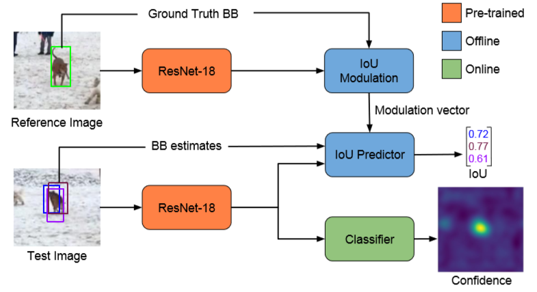
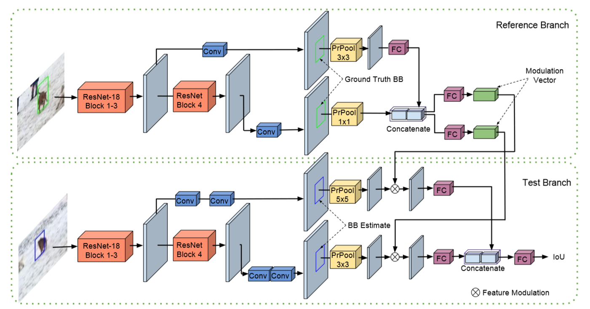
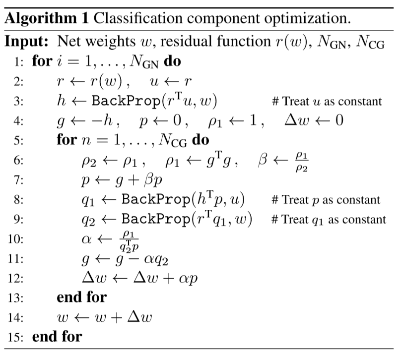
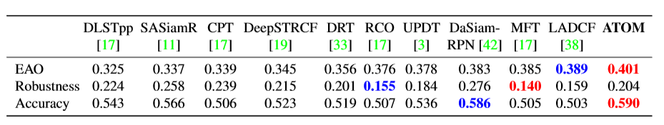

# ATOM-2019
* ATOM：Accurate Tracking by Overlap Maximization
* Paper ： https://arxiv.org/abs/1811.07628
* Code ：https://github.com/visionml/pytracking

## Overview
1. 大佬决定在跟踪精度上做改进，抛弃anchor，使用GT添加高斯噪声的方式。
2. 受到IOUNet的启发，将class-special的IOU-Net改为target-special的IOU-Net使其适用于tracking的情境。
3. SGD算法收敛太慢，所以提出了新的收敛算法（共轭梯度+牛顿高斯）。

<!--more-->

## why
1. 近年来，大家的目光都聚焦在tracking的鲁棒性上，而忽略了tracking的准确性。
2. 在IOUNet的启发下作的一些改进。

## what
### 网络结构
1. target分类（online）
   * 区分前/背景提供一个粗略的定位，online提高分类的鲁棒性
   * 使用2层全连接层
   * 抛弃SGD，使用共轭梯度+牛顿高斯方法优化
2. target估计（offline）
   * 用于寻找overlap最大化的bbox，offline学习一个更通用的IoU预测表示
   * 使用IOU-predictor网络来进行target估计
   * input是image object的feature和bbox_delta，然后使用PrROI pooling得到一个预定义大小的feature。

## how
1. 网络结构   

   * backbone ：Resnet-18（在ImageNet上预训练）
2. IOU Modulation

   * 对reference帧和search帧进行了特征提取，之后通过channel-wise multiplication做特征融合。
3. IOU predictor
   * 由3层FC层组成
   * IOU predictor input : 当前帧的feature，当前帧的bbox估计，reference帧的feature，reference帧中的target bbox
   * IOU predictor output : 当前帧中预测的每一个bbox的iou值
4. Classifier
   * 2个全卷积网络
   * 第一层由1x1卷积构成，将通道减小至64，减少计算量。
   * 第二层使用4x4的单输出通道kernel
   * 使用PELU作为输出的激活函数，可以忽略掉简单的负样本
   * 第一帧，使用了数据增强(旋转，模糊，dropout等)
   * 在分类过程中使用了自定义的优化策略（共轭梯度+牛顿高斯）

5. 实现细节
   * 使用了LaSOT和TrackingNet数据集，同时使用了COCO数据集来进行数据增强操作
   * 图像对采样间隔为50
   * 每个图像对，对应生成16个候选的bbox（GT+高斯噪声，同时确保最小iou为0.1）
   * 权重初始化 -  Delving deep into rectifiers: Surpassing human-level performance on imagenet classification. In ICCV, 2015. 5
   * loss使用MSE loss，训练40个epoch，每个epoch使用64个图像对
   * 学习率初始为10e-3，weight decay factor为0.2（15epoch）
   * 在训练过程中，backbone的weight被freezed
   * 硬负样本挖掘，当distractor在分类score中取到峰值，会将该样本使用2倍的lr在优化训练一轮。同时，在score低于0.25时判断为丢失。
   * 最后的输出使用IOU最高的3个bbox的平均值。

## results
1. Nvidia GT-1080 GPU上运行30FPS

## other points
* 低层包含更多的表面信息，那为什么不用底层feature做reg,用高层语义信息去做分类。