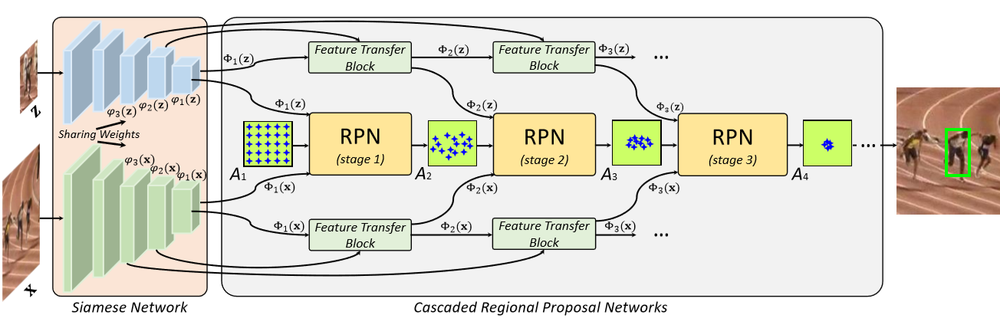
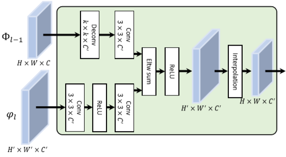
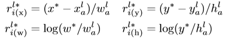
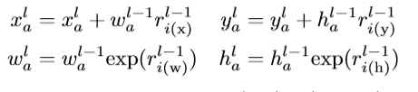

## C-RPN-2019
* Siamese Cascaded Region Proposal Networks for Real-Time Visual Tracking
* Paper：https://arxiv.org/abs/1812.06148?context=cs
* Code：https://github.com/zhu2014yi/CRPN

## Overview
1. 通过级联RPN（多stages）筛选，解决了样本不平衡问题。(多阶段筛选)
2. 构建FTB block用于高/低特征融合，结果更加精确。（多层融合）
3. 其实跟SPM Tracker的出发点相同，都是针对Siamese网络中相似物体的drift问题，解决思想也相同，都是使用多stages过滤以获得更好的效果，但是整体来说效果离SPM差很多，首先多RPN肯定很耗时，FPS在36左右，同时精度提升也不是特别明显，VOT16上EAO为0.363。

<!--more-->

## why
1. 针对Siamese自身存在的问题 -- 相似物体的drift
   * 样本不平衡问题
   * 大多数样本为简单负样本
2. 在现有的siamese网络中，低层的feature信息没有合理利用
   * 高层的信息可能包含更多的语义信息，造成相似物体的drift

## what 
1. 提出级联RPN的网络结构，分为3个stages，每个stage都做分类和回归对上一阶筛选的proposals在进行refine，每个阶段都会逐渐过滤简单负样本，保留为下一个阶段保留难例负样本。
2. 用FTB做高低特征融合。

## how
1. 网络结构如图。仍然使用AlexNet结构提取特征。
   
2. FTB结构如图。高层feature经过反卷积恢复尺度，然后与底层feature通过element-wise结合，最后对融合后的feature进行插值操作，为了确保最终所有的RPN都能对应相同的GT。
   
3. GT和各阶段RPN的计算。
   
   
