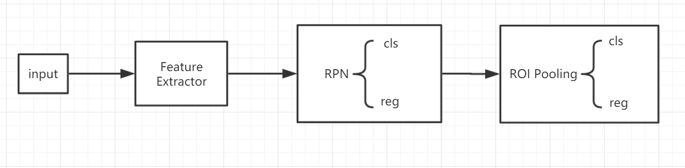
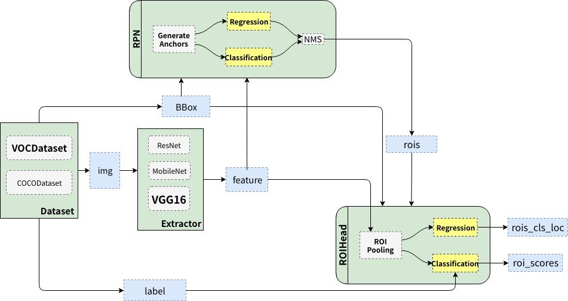
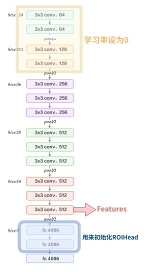
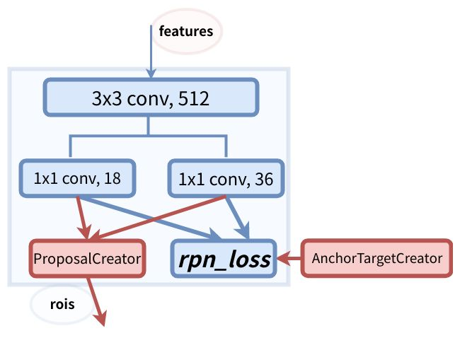
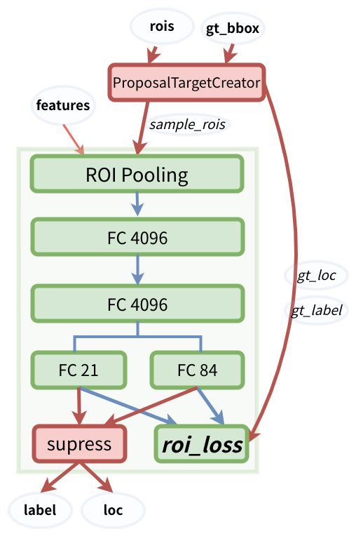
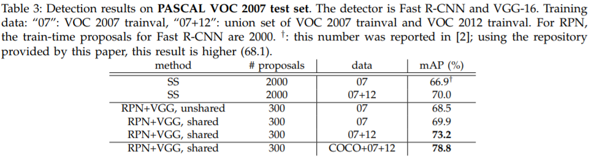

## Faster-rcnn-NIPS2015
* Faster RCNN：Towards Real-Time Object Detection with Region Proposal Networks
* Paper：https://arxiv.org/abs/1506.01497
* Code ：https://github.com/chenyuntc/simple-faster-rcnn-pytorch
* 参考：https://zhuanlan.zhihu.com/p/32404424

## Overview
1. 使用RPN代替了耗时的selective search操作。
2. 大致过程如下图。**特征提取，RPN提取ROI（二分类+回归），ROI Head（多分类+回归）**

<!--more-->

## why
1. 基于**selective search的方法速度太慢**。
2. **二阶段**（粗细粒度的筛选），可以使得检测的精度极大提升。

## what
1. 主要贡献在于，使用RPN替代了selective search方法。
2. Faster RCNN可主要分为三个阶段。
* 阶段一，**特征提取**。
* 阶段二，使用**RPN提取ROIs**，并对其中部分样本（256）进行二分类和回归，NMS过滤。
* 阶段三，使用**ROI Pooling**，对ROIs中的部分ROI进行Pooling操作统一到相同尺度，在做分类和回归，NMS过滤。

## how
1. Faster RCNN主要分三步：特征提取，RPN提取ROIs（**二分类**+回归），ROI Head/Pooling（**多分类**+回归）

### Feature Extractor 
1. 一般使用与训练好的VGG16，前4层的卷积的学习率设为0（为节省显存），Conv5_3的feature作为输出；VGG最后的三层全连接层的前两层，一般用来初始化RoIHead的部分参数。 

### RPN
1. 每个位置使用的anchor个数为9个，所以整张图大概会生成20000个anchors。
2. **RPN结构**   
   3x3的卷积不太清楚什么用意？后接两个1x1的卷积分别用于二分类（9x2）和位置回归（9x4）。
3. **AnchorTargetCreator**   
   RPN利用AnchorTargetCreator从20000个anchor中选取256个做分类和回归。
* 计算所有anchors与GT的iou，每个GT对应IOU**最高**的anchor作为正样本。
* 其余样本随机选择与GT的iou大于阈值0.7的样本作为正样本。
* 随机选择与GT的iou小于阈值0.1的样本作为负样本。正负样本的比例大概为1：1，总数为256。
4. **ProposalCreator**   
   RPN利用ProposalCreator生成ROIs。
* 计算20000个anchors属于前景的概率，对应的位置参数
* 选取概率较大的12000个anchors，利用回归的位置参数修正这些anchors
* 使用NMS，选择出anchors最大的2000个ROIs
* inference时候，12000，2000分别对应6000，300
5. **损失计算**
* 分类损失，使用交叉熵。
* 回归损失，使用Smooth L1 loss

### ROI Head/pooling
1. **ProposalTargetCreator**
* ROIs和GT的iou大于0.5的选择32个。
* ROIs和GT的iou小于0/1的选择96个。
2. **ROI Pooling**   
   在RPN提供的2000个ROIs上，首先使用ProposalTargetCreator挑选128个ROIs，然后使用ROI Pooling将其pooling到统一的尺寸（128x512x7x7，ROI pooling是为了**共享权重**），继续进行分类和回归。FC21用来分类，20+1背景；F84用来回归，21x4。
3. **损失计算**
* 分类，交叉熵；回归，Smooth L1 loss
* 回归，只对ROI中的正样本计算loss

4. **小结**
* RPN阶段是前/背景的二分类，ROIHead是21分类
* RPN阶段，ROIHead阶段都做了NMS
* RPN阶段，ROIHead阶段都进行了回归
### Loss
1. 4种损失加权求和
2. RPN分类/回归损失，ROI分类/回归损失

## result
1. mAP为0.699，fps为5

