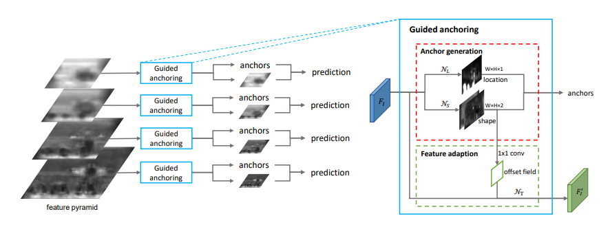
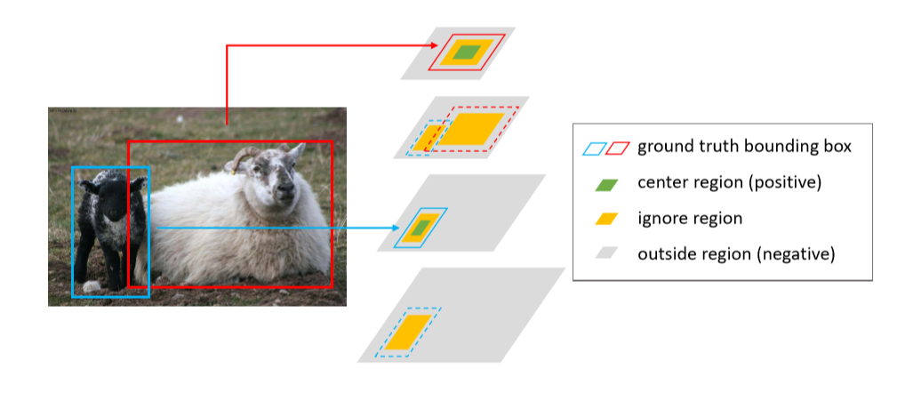

## GARPN-2019
* GARPN：Region Proposal by Guided Anchoring
* Paper：http://arxiv.org/abs/1901.03278
* Code：https://github.com/open-mmlab/mmdetection

## Overview
   * 先前的anchor是在feature map上的每个点都设定(均匀分布)，本文的思想是先预测最有可能出现object中心的区域，然后在该区域进行anchor w h的预测，从而确定了anchors，减少了计算量。
   * anchor和feature map的匹配问题，根据anchor shape计算deformable conv的offset，从而对feature map进行变换，以生成新的feature map。
   * 在新的feature map上进行分类和回归。
   * 在resnet50-fpn作为backbone，其recall(AR)提高了9.1个点，mAP提高了1.2-2.7个点。

<!--more-->

## why
* 之前的anchor尺度/比例(超参)需要人为设定，设定不好对性能影响较大。
* 前anchor方法中的大多数anchor都分布在背景区域，对于proposal没有作用，徒增计算量。
* 数据集中的object形变较大，预定义的anchor不一定能满足其object尺寸。
* 所有。出现了本文稀疏，形状可变的anchor。

## what
* p(x,y,w,h|I) = p(x,y|I)p(w,h|x,y,I)   
  将anchor的坐标概率分布分为两个条件概率，即先进行anchor的位置预测，再进行形状预测。

## how
1. **网络结构**
   

2. **网络细节**
* 主要为两部分：anchor生成+feature调整
* anchor生成部分：   
  F1(feature map)通过N_L分支预测anchor location,通过N_s预测anchor shape。
*  feature adaption:
  使用anchor信息生成可变形卷积的offset，在使用可变形卷积对feature map进行调整，以生成新的feature map。

3. **anchor定位预测**
* 二分类问题
* 在feature map上预测可能出现object中心点的位置(对应原图的一区域)，该中心区域为正样本，超出gt的区域作为负样本，gt和中心区域的部分忽略。
* N_L子网络，在feature map上使用1x1卷积计算出一个score map,再使用sigmoid将score转换为概率。
* 

4. **anchor形状预测**
* 回归问题
* 该部分使用IOU loss。设定了几组常见的w,h,然后计算anchors与所有gt的IOU,然后将该anchor分配给IOU最大的gt。
* w = σ·s·e_dw, h = σ·s·e_dh   
  N_s子网络预测输出dw,dh；dw,dh通过上式进行变换得到w,h。其中，s为stride，σ为经验比例因子(文中设定为8)。
* 原来直接预测w,h(范围在[0,1000]),现在通过预测dw,dh(范围在[-1,1])经e后可达到原先效果

5. **特征适配**

* N_t子网络(使用3x3的可变卷积),根据anchor shape预测deformable conv的offset(offset是通过anchor的w和h经过一个1x1conv得到的),去做一个feature map的变换，以得到新的feature map。
* 在新的feature map上进行分类和回归。
* FA提升了近5个点。

6. **Tricks**
* 减少proposal的数量
*  增大训练时正样本IOU阈值(重要，提升了2.7个点)

## others
### 缺点
1. 论文假设图像中的目标是稀疏的。如果是稠密图像，比如车站或广场的拥挤人群，检测效果有待检验。
2. 每一个点只产生一个anchor，那么对于那些目标中心重合，即一个点需要负责检测两个目标，似乎无法处理。
3. 采用deformable卷积会相对地降低速度，同时根据DCN v2的分析，在deformable卷积中加入可调节的机制可能会更好。

### 可形变卷积
* [Deformable conv简介-CVPR2017](https://www.zhihu.com/question/57493889)

### 评价标准
* R(recall): 查全率，R = 预测出的正样本/原数据集中的所有正样本
* AR : 平均查全率
* P(precision)：查准率，P = 预测中的正样本/预测出的所有样本
* AP : 平均查准率
