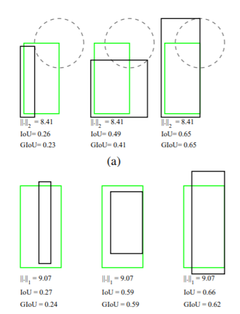
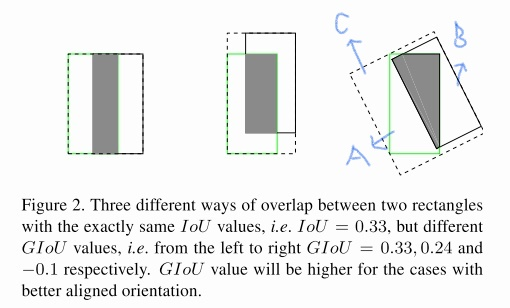

## GIOU-2019
* GIOU：Generalized-Intersection-over-Union
* Paper：https://arxiv.org/abs/1902.09630
* Code：https://github.com/generalized-iou/g-darknet

## Overview
   1. 提出新的loss指标GIOU,使用评价标准作为loss，同时避免了IOU作为loss的缺点，有较好的提升。    
   2. 在anchor较少的detection中有较为明显的提升(3-6个点)   

<!--more-->

## why
1. 大家都在模型，trick上下功夫，忽略了在L1/L2上的改进(L_n范数对物体的scale比较敏感)。
2. 直接使用iou作为loss存在的问题。
   * 两个框没有相交，IOU=0，loss = 0,无法进行梯度的反向传播，无法学习训练。
   * IOU无法精确衡量重叠程度，且IOU的变化无法反馈定位框的重合度和方向。如下图。   

## how
1. 设定gt为A，pred为B，先求包含A，B的最小闭包C。
2. 计算C中去除A∪B后剩下的面积D，即D = C\\(A∪B)。
3. 计算IoU
4. GIoU = IoU - D/C   
5. IOU ∈ [0,1]，GIOU ∈ [-1,1]
   

## others
* 起初自己也想过使用iou作为loss，但是看到网上说iou作为loss可能存在梯度无法回传问题时，没有多思考去寻找解决办法。所以，遇到问题深究原因，考虑有没有可替代的近似方案。
* IOU既然对于尺度不敏感，L_n对尺度敏感，那两者就可以做loss的结合。