# IOUNet-2018
* Acquisition of Localization Confidence for Accurate Object Detection
* Paper : https://arxiv.org/abs/1807.11590 
* Code : https://github.com/vacancy/PreciseRoIPooling

## Overview
1. 目前大多数的tracker都是通过cls score来确定物体的位置，但是分类得分高并不意味着定位的准确度高，所以用cls score去做NMS并不是特别合理，因为会把定位精准但分类得分低的卡掉。所以作者提出了使用iou score作为排序指标。
2. Paper提出了IOU-guided NMS，PrROI（使用积分的方式计算ROI特征）。
3. 很有分量的文章，受益匪浅。

<!--more-->

## why
1. 使用预测box的cls score去做NMS并不合理,如图所示。
   * 根据皮尔逊相关系数，分类score和iou并不成正相关，而定位score和iou是成正相关。
   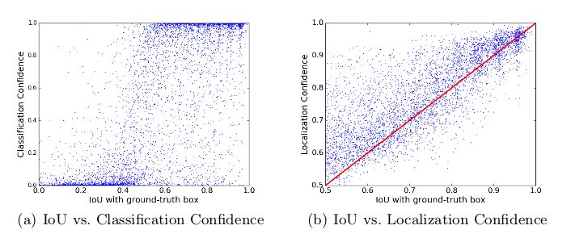
   * 并且，分类得分高的并不一定定位得分高，使用cls score做NMS会把这些定位得分高的box卡掉。
   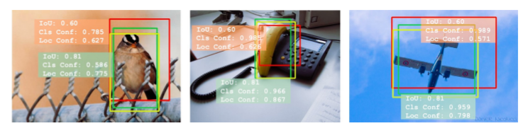
   * 通过下图也可以看出，NMS很容易把IOU较高的bbox过滤掉（当然其中肯定存在大量的冗余bbox）。
   
2. 传统的基于regression的bbox refine的问题。
   * regression-based和optimization-based的直观效果差距。
   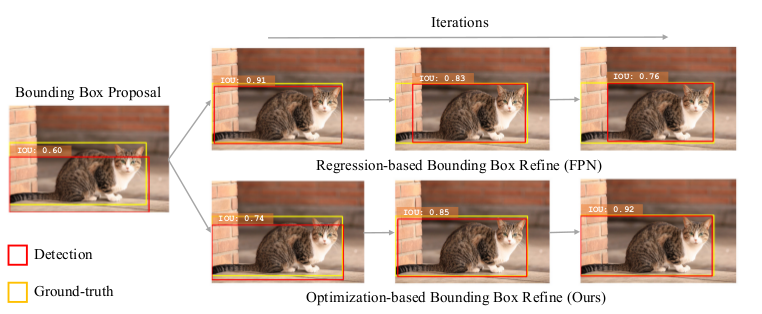
   * regression-based是通过回归[cx,cy,w,h]使其与gt尽可能接近。理论上不断refine会得到很精确的结果，但是cascad RCNN相关实验表示在随着refine次数的增加效果会下降，(**为什么会这样还需要做点工作**)。但是使用IOU的方式在不断refine后不会出现该情况。
   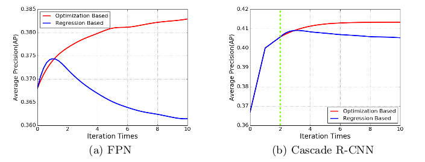

## what
1. 提出了IOU-Net来预测bbox和gt的IOU值。
2. 将ROI pooling/Align更换为prROI。

## how
### IOU-Net

1. IOU predictor的input是image通过FPN后的feature。output是每个bbox的iou score。**这里使用的proposal并不是来自RPN，而是通过对GT进行随机变换（添加随机噪声等）得到的一系列proposals**，然后对bbox进行过滤。对于每一个bbox会使用prROI-pooling在FPN上提取的feature，这些feature被送入2层fc层做IOU预测。

### IOU-guided NMS
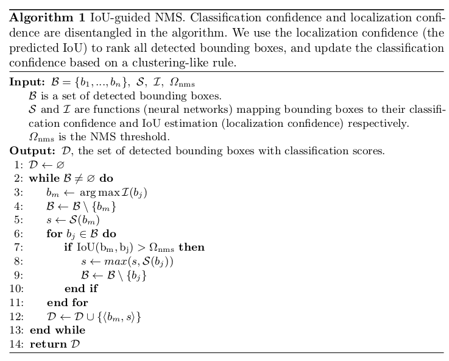
1. 将NMS算法中的排序指标改为IOU score。
2. 通过对iou进行聚类的方式对cls score进行更新(**重点在第5,8行**)。在根据iou过滤的过程中，将过滤掉的bboxes中的最高的cls score分配给当前的bbox，所以保留下的是其iou簇中最高的分类得分。感觉这样做的好处是消除iou一致情况下cls score的差别。

### Optimization-based bbox refinement。
#### IOU支路的梯度计算和参数更新
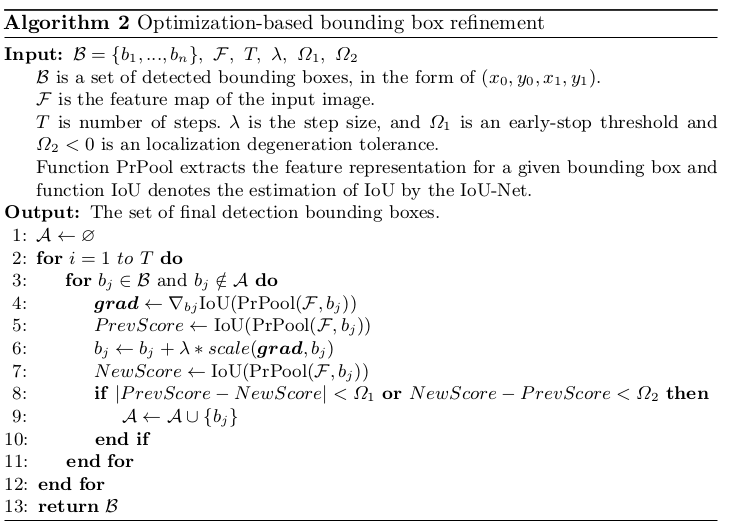

#### prROI pooling
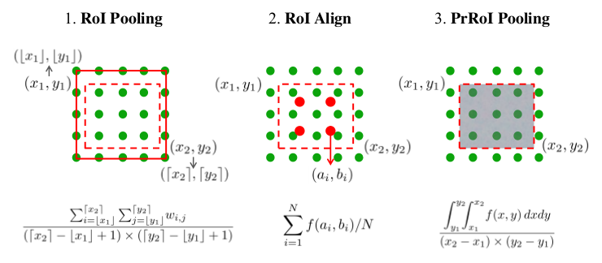
1. 上图是ROI pooling，ROI align，prROI pooling的对比，这是三种都是基于ROI坐标根据feature map提取feature的方法。
2. ROI pooling。
   * 先将预测得到的ROI除以stride，并量化取整得到整数值的ROI
   * 将ROI分为k*K个grid，每个grid的坐标为(x1,y1,x2,y2)，其坐标值不一定为整数，所以要量化取整，左上角向下取整，右下角向上取整，得到整数的坐标值。然后可以采用均值/最大值操作得到该grid的特征值。
   * 优点：解决了不同大小ROI的尺寸不统一的问题
   * 缺点：量化操作会引入一定的误差
3. ROI Align
   * 对ROI pooling进行改进，直接使用浮点坐标值将ROI划分，消除了量化操作引入的误差。
   * 对ROI的每个grid的坐标也不再进行量化，而是在grid中均匀取4个点，通过公式2（插值）计算得到该点的特征值（该公式根据距离对周围的4个点进行加权计算，距离越近权重越大），然后对其求平均
   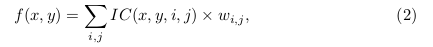
   * 优点：消除了量化操作带来的误差
   * 缺点：没有考虑grid的大小差异 
4. PrROI pooling
   * 使用积分的方式计算每个grid的特征值
   * ROI Align仅考虑该grid中4个插值点的均值，PrROI pooling是将grid中的值看做是连续的，通过对该grid中所有点求积分得到该grid所包围点的总和，最后除以面积。
   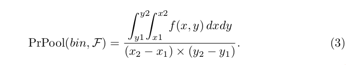
   * 优点：结果会更加精准

## result
1. IOU-guided NMS 
   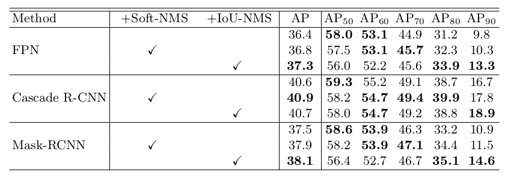 
   
   * 当IOU threshold设定较高时，iou nms的效果会更加明显，因为threshold较高的时候需要bbox的坐标更加准确才会能更好的AP值。
2. optimization-based bbox refinement
   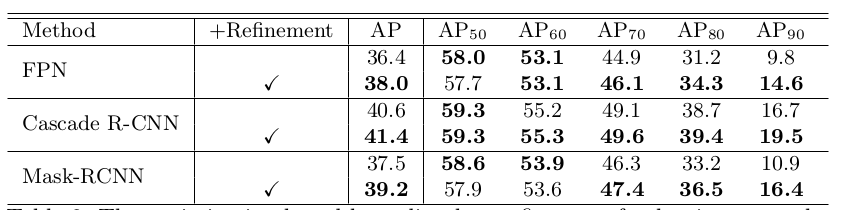 
   
   * refinement在各个模块上都有不错的提升。
   
   

## other points
### NMS
1. 将所有的bbox按cls score降排序生成一个list
2. 从top 1 bbox开始，计算该bbox与其他bbox的iou，若iou大于设定阈值则剔除。
3. 再从top 2 bbox开始，计算该bbox与其他bbox的iou...
4. 重复操作，直到list中所有元素都筛选完毕

### soft NMS
* 并不是真正的抑制，而是对要过滤掉的bbox乘以一个衰减系数。
1. 将所有的bbox按cls score降排序生成一个list
2. 从top 1 bbox开始，计算该bbox与其他bbox的iou，若iou大于设定阈值则**将其乘以一个系数，使其缩小，之后在重新比较**。
3. 再从top 2 bbox开始，计算该bbox与其他bbox的iou...
4. 重复操作，直到list中所有元素都筛选完毕。
5. 对于遮挡，目标密集的情况效果很好，但是对于稀疏的场景，召回率可能会低于NMS。

### 想法
1. 对GT做随机调整这种方法，感觉可以用