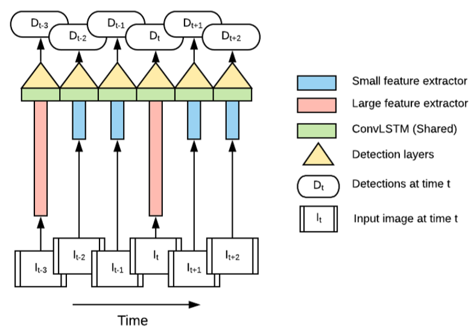
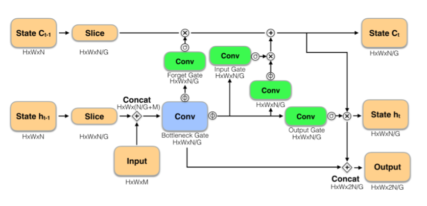
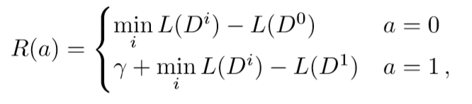
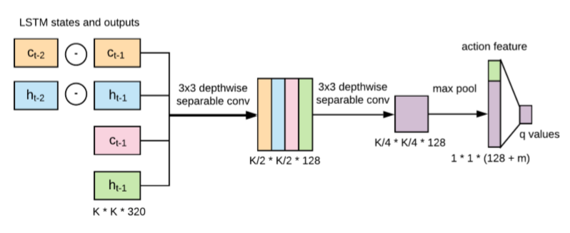
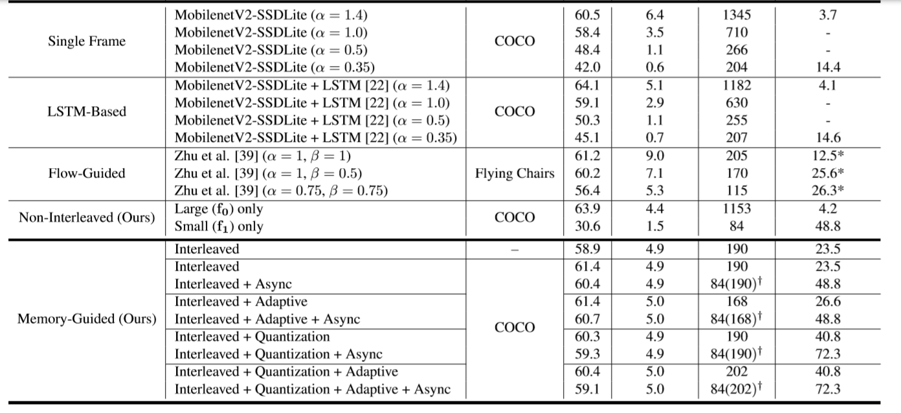

# Memory-Guided-Video-Detection-2019
- Looking Fast and Slow: Memory-Guided Mobile Video Object Detection
- Paper: https://arxiv.org/abs/1903.10172
- Code: https://github.com/tensorflow/models/tree/master/research

## Overview

1. 提出了memory-guided的多特征网络提取的网络结构，使用快/慢特征提取网络分别提取不同帧特征，可以减少冗余计算。
2. 使用Double Q-learning强化学习策略来执行memory更新，进行特征提取网络的选择。
3. 在移动设备上可以实现高精度，高速度（70fps）。

<!--more-->

## why
1. 作者将video object detection大致分为三类。
* 后处理方法。使用单帧检测的方式，然后与前帧中的track进行数据关联。seq-nms通过动态编程和提高弱检测的置信度来进行跟踪。TCNN使用光流法来传播检测，同时使用跟踪算法寻找tubelets来重评分。**缺点**是仍然是在每帧上做检测。（看描述感觉是多目标跟踪）
* 特征流方法。将网络的中间特征通过光流方式传播。DFF在稀疏关键帧上进行检测，然后再其他所有帧上按照计算光流的方式进行传播。FGFA通过相邻帧与当前帧特征进行加权平均。
* 多帧方式。即同时对多帧做处理。D&T做了检测和跟踪的结合，使用了ROI tracking和相邻帧loss的方法。STSN使用DCN来采样相邻帧特征。**缺点**是仍然需要高精度检测而不是直接使用之前帧的检测结果。
2. 稀疏处理视频帧有很多方式，从固定间隔，到启发式策略。文中使用强化学习方式来构建关键帧选择策略。

## what
1. 交叉模型。使用memory guided策略，结合多个特征（大/小）提取网络，大/小网络在视频检测过程中交替使用。
2. 使用DDQN强化学习策略来选取网络使用策略来进行memory更新。

## how
1. 交叉模型结构。多个特征提取器顺序或同时执行，提取的feature通过memory机制进行增强/调整。   

2. memory模型。在LSTMs的基础上，对LSTM cell进行了三点改进，融合不同特征提取器的feature。   
* 在bottleneck和output之间添加了skip connection。
* 使用channel-wise的方式，将LSTM state等分为G组，然后使用组卷积。
* 使用state skip update方法。相当于跳过f1的状态更新，直接使用之前f0的状态。这是因为LSTM中sigmoid的缺点，在多次更新之后几乎会完全遗忘之前的状态。

3. DDQN寻找自适应交叉策略
* 动作空间。包含m个动作。
* 状态空间。S = (ct,ht,ct − ct−1,ht − ht−1,ηt) ，当前LSTM的状态，状态的相对之前改变，动作的历史参数（长度为20的向量，运行的前k步是1，其余是0）
* 奖励函数。速度奖励 + 精度奖励，给出γ奖励。其中，L(Di)为使用feature_i做检测的loss。

* DDQN的网络结构如下。

## result

