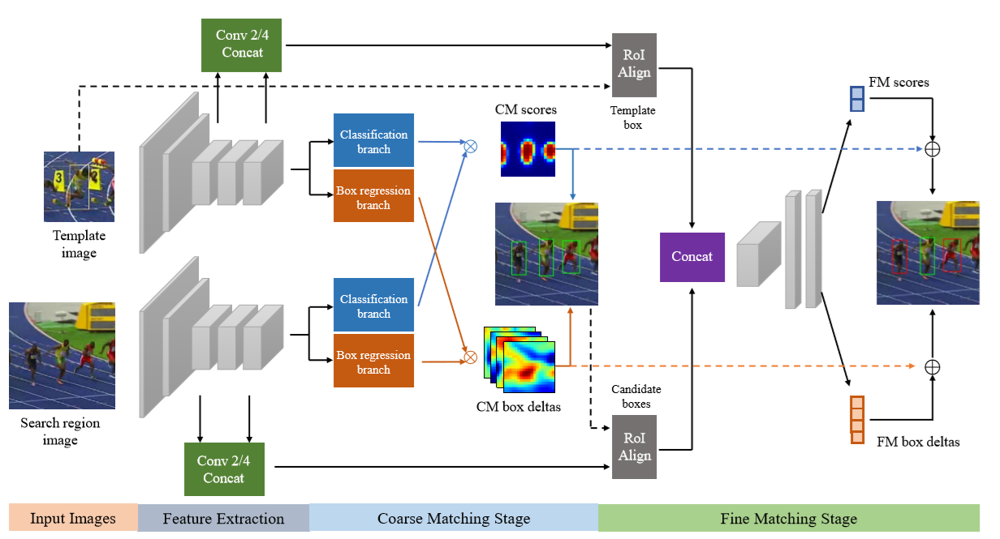
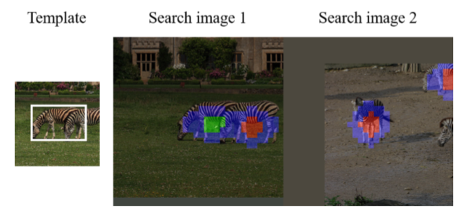

## SPM
* SPM-Tracker: Series-Parallel Matching for Real-Time Visual Object Tracking
* Paper：https://arxiv.org/abs/1904.04452v1
* Code：https://github.com/microsoft/SPM-Tracker

## Overview
1. 将Tracking中的两个需求（Robustness，deiscrimination）分别放在两个阶段（two-stage：CM->FM）实现。
2. 感觉效果惊人！OTB-100上的AUC为0.687，VOT-16上的EAO竟然达到了0.434，GPU上的fps为120，牛！
3. 抓住了siamese网络的缺点(相似物体容易drift)，解决方式就是在一阶段CM提取目标物体和其相似物体作为正样本，在二阶段FM在仔细区分object和其相似物体，也算是在image中尽可能多的提炼信息。

<!--more-->

## why
1. 在tracking的过程中，既要求tracker有足够的判别力(针对相似物体或者相似背景等)，又需要足够的鲁棒性(对于物体的形变，光照等)。但是用一阶段的方法学习两种能力，其间会相互影响。
2. 现存的tracker速度太慢。

## what
1. 将Tracking分为两阶段来做，分别是CM，FM。CM负责鲁棒性，FM负责判别力。两阶段的融合省去了做多尺度测试。
2. 在CM阶段同一类物体都被作为同一物体，来提高CM的鲁棒性。在FM阶段通过距离学习子网络替代了cross corrrelation来提高网络的判别力。CM的输出作为FM的输入，最终的输出是两阶段的融合。
3. SPM的优势
   * two-stage，容易train
   * CM的输出作为FM的输入，正负样本的比例和难样本得到了平衡
   * 两个阶段输出的融合可以有更高的精度
   * FM阶段有较少的proposals，省去了cross-correlation操作，改为使用trainable distance measure

## how

1. **网络结构**
   * 特征提取：Siamese Alexnet(在ImageNet上预训练)
   * CM Stage使用SiamRPN的网络结构，最小化类内特性，专注于robust
   * ROI Align用来为每个proposal生成固定长度的区域特征
   * FM Stage为距离学习网络，最大化不同物体间的特性，专注于discrimination
   * 最终输出为两阶段decision的融合(score + bbox deltas)
2. **CM阶段**
   
   * 将image中同类物体的**中心区域（红，绿）**都作为正样本，蓝色区域为忽略区域
3. **FM阶段**
   * 该阶段的重点在于将CM阶段过滤后的object与背景/相似物体区分开   
   * 经CM过滤后剩余较少的proposal，所以丢弃了cross correlation操作，使用了新的关系网络来进行距离计算。
   * 对于每一个proposal，直接从feature map上crop然后使用ROI pooling生成固定大小的feature，同时将高低层的信息concatenation。
   * 关系网络的输入是图像对concatenate的feature信息，后接1x1卷积，再接2个全连接层（256个neurons），用来cls和box regression
4. **融合**
   * 最终CM,FM阶段的scores和bbox deltas进行加权融合

## other points
1. CF-based执行必不可少的是在线更新策略，但是结合deep learning是特别慢的，所以researcher使用static discriminative trackers，像siamFC等。
2. SiamRPN使用RPN在提高bbox regression方面做了改进，DaSiamRPN使用样本策略(相似的同类物体作为正样本提高robust，语义信息接近的不同类物体作为负样本提高distrimination)在discrimination方面做了提升。
3. 网络细节
   * 在使用的AlexNet中保留了padding，因为ROI align需要feature和source image的像素对齐。
   * CM阶段使用no padding的中心feature(应该是从padding后的feature上crop下来)
   * 每个ROI pooling后的feature大小为6x6x640
4. train细节
   * IOU 大于0.6，小于0.3的样本被保留。
   * loss :两个阶段，四个loss的加权和， cls : cross entropy , reg : smooth l1 loss