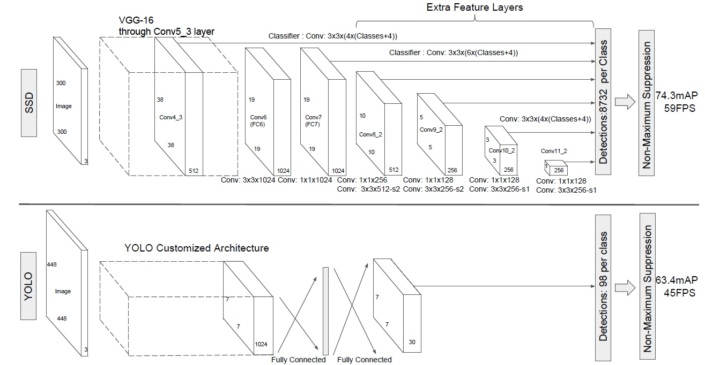
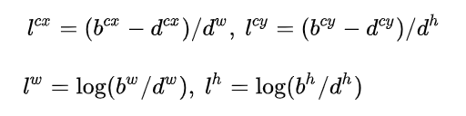
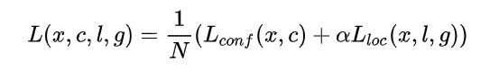
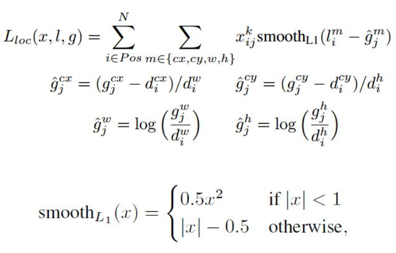

# SSD - 2015
* SSD: Single Shot MultiBox Detector
* Paper：https://arxiv.org/pdf/1611.10012.pdf 
* Code：https://github.com/amdegroot/ssd.pytorch

## Overview
1. SSD与Yolo v1的对比
* **卷积检测**。抛弃FC层采用卷积做检测。SSD每个检测框都对应输出一套独立的检测值。
* **多尺度特征图**。采用多尺度特征图，大尺度检测小物体，小尺度检测大物体。
* **先验框**。采用不同尺度/长宽比的先验框。
2. 速度：58fps。mAP为72.1

<!--more-->

## why
1. 针对Yolo v1存在的定位不精准，对小物体不友好等缺点的改进。

## what
1. one-stage检测。均匀地在图像上的不同位置，使用不同的尺度/长宽比进行采样，然后使用CNN提取特征后直接进行分类和回归。
2. SSD结合了卷积预测，多尺度特征，先验框来改进Yolo v1中存在的缺点。

## how
1. **网络结构**
* **输入**：300x300/512x512
* **网络结构**   
  ①主干网络使用VGG16，分别将VGG16的全连接层fc6和fc7转换成conv6和conv7，移除dropout和fc8层，并增加了卷积层来获得更多的feature map。   
  ②Conv6使用扩展卷积，来扩大卷积的感受野。Conv6采用3x3大小但dilation rate=6的扩展卷积。   ③使用feature map大小分别为38，19，10，5，3，1。不同feature map上设定的先验框数目不同，分别为4，6，6，4，4。   
  ④随着特征图大小降低，先验框尺度线性增加。长宽比一般选取{1,2,3,1/2,1/3}
  
* **输出**  
  ①检测值包含两个部分：类别置信度和边界框位置，各采用一次3x3卷积来进行完成。令nk为该特征图所采用的先验框数目，那么类别置信度需要的卷积核数量为nk x C ，而边界框位置需要的卷积核数量为nk x 4。   
  ②各个feature map对应：w x h x nk x (C+4)
* **真值**  

2. **损失函数**
* 位置损失 + 置信度损失。其中N为正样本数，

* 位置损失

* 置信度损失 - softmax loss

3. **训练细节**
* 先验框匹配   
 ①Yolo是gt所在单元格中与其IOU最大的那个作匹配。   
 ②第一步，SSD是找到每个gt与其最大的IOU作匹配，保证每一个gt都一定有一个先验框与之匹配。将匹配的bbox作为正样本，其余为负样本。第二步，将剩余先验框中与gts的iou大于阈值的进行匹配。匹配成功的都是正样本。   
 ③再采用hard negative mining，对负样本按照**背景**置信度误差进行抽样，选取误差最大的topk个，保证正负样本的比例为1：3。   
* 使用了数据增强。裁剪，旋转，扭曲，随机采样等等。

## result
1. 数据增强，可以提高9个百分点（65.6 - 74.3）。
2. 多尺度检测，可以提高12个百分点（62.4 - 74.6）。