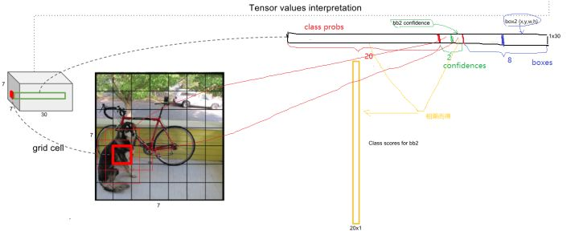

## Yolo v1 - 2015
* Yolo-v1：You Only Look Once, Unified, Real-Time Object Detection.
* Paper：https://arxiv.org/abs/1506.02640
* Code: https://github.com/gliese581gg/YOLO_tensorflow

## Overview
1. 经典的one-stage。直接对原图进行网格划分，将原图分为nxn的小块，然后通过卷积产生nxn的特征图，其一一对应，feature map上每个元素预测对应单元格内的分类/置信度/bbox偏移。
2. 速度：155fps，mAP：63.4

<!--more-->

## why
1. DPM采用不同大小和比例（宽高比）的窗口在整张图片上以一定的步长进行滑动，然后对这些窗口对应的区域做图像分类，来实现对整张图片的检测。DPM的缺点，目标大小未知，需要使用不同的大小/比例，步长，计算量很大。
2. RCNN使用selective search的方法仍然耗时。

## what
1. Yolo直接将image分成nxn的网格，然后根据卷积生成相同大小的feature map，feature map上每个元素预测对应单元格内的分类/置信度/bbox偏移。

## how
1. **网络结构**
* 输入：448x448的image   
   划分为7x7的网格。
* 网络结构  
backbone：使用了24个卷积层，2个fc层

训练过程中的网络结构。在googLenet之后添加了4个随机初始化权重的Conv层和2个fc层。

* 输出：7x7x30    
    其中30为20个类别概率，2个置信度，2个bbox的(x,y,w,h),其中，预测的x,y是中心坐标相对于左上角坐标的偏移量，单位是相对于单元格大小的；w，h是相对于整个图片的宽和高的比例；所以xy在[0,1]范围内。
    预测tensor示意图。网络计算量：SxSx(Bx5+C)

2. **损失函数**
* 采用MSE损失函数，对于定位损失，分类损失分别采用不同的权重。定位损失使用较大的权重（5），然后分类损失权重分别为（0.5无object，1有object）。
* 其中，要各个大小bbox要同等对待，但是较小的边界框的误差更敏感，所以将网络bbox的w,h的预测改为了对其平方根的预测。

## result
1. **优点**
* 简洁，速度较快，可以达到155fps，mAP为63.4
* 对整个image做conv，不容易对背景误判
2. **缺点**
* 每个单元格仅预测两个bbox，且共享一个类别，所以对密集物体判别不好。
* 定位不精准。
* 对小物体不友好，且无法定位比例不同寻常的物体。