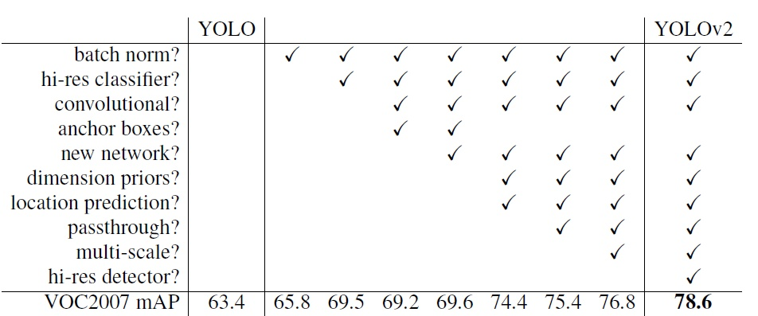
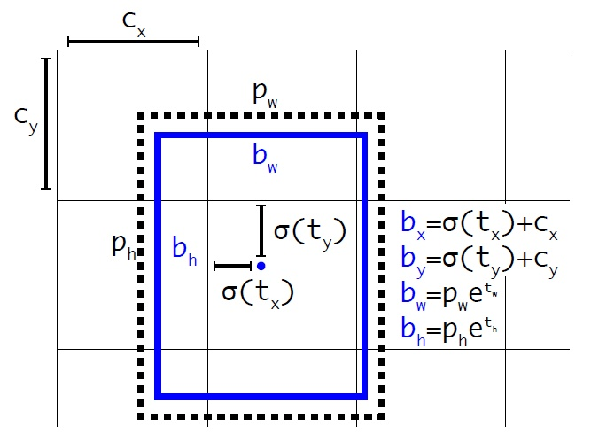
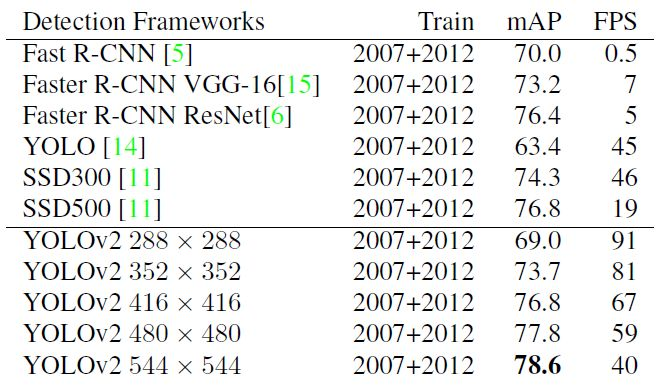
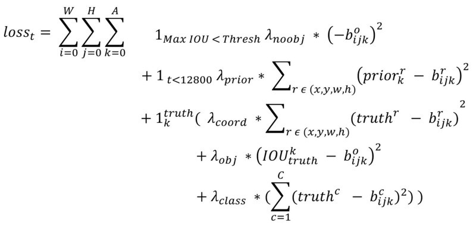
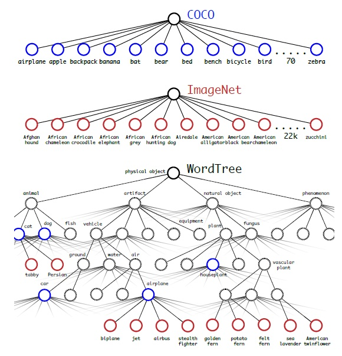

## Yolo v2 2017
* Yolo-v2（YOLO9000）: Better, Faster, Stronger
* Paper：https://arxiv.org/abs/1612.08242
* Code: https://github.com/marvis/pytorch-yolo2

## Overview
1. 基于Yolo v1做了诸多改进。针对Yolo v1**定位不精准，召回率低，对小物体不友好的问题，提出了位置限定预测，Anchor+卷积预测，pass-through操作**等。
2. 同时，引入了**BN，高分辨率输入，边界框聚类分析，darnet-19，多尺度训练**等，提高了检测性能。
3. 最终在输入为544x544时，VOC07上mAP可达到78.6，相对应的fps为40（不同输入对应不同结果）

<!--more-->

## why
1. Yolo v1虽然检测速度很快，但是**定位精度不准，物体定位不准确，召回率低，对小物体不友好**，精度效果不如RCNN好。

## what

1. **Batch Normalization**
* 在Yolo v2中每一个卷积层之后，都添加BN层，抛弃Dropout。
* BN可以提高模型的收敛速度，起到一定的正则化效果，防止模型过拟合。
* 使用BN后，mAP提高了2.4%
2. **高分辨率输入**
* 在Yolo v2中，使用448x448高分辨率输入，抛弃224x224低分辨率输入。
* 低分辨率不利于检测模型。因为在ImageNet上的预训练模型使用的为224x224的输入，在检测数据上使用448x448进行finetune效果不好；Yolo v2增加了在ImageNet上使用448x448输入来finetune的步骤，使模型可以适应检测数据上的高分辨率输入。
* 使用高分辨率后，mAP提高了4%
3. **卷积预测+Anchors**
* 更换FC层预测为Conv预测，同时使用anchor box。
* Yolo v2采用416x416的输入，stride为32，是为了**保证最后feature map的大小为奇数（13x13）**，其包含一个中心点，对于一些大物体，中心点通常落到图片的中心位置，使用feature map中心点去预测这些物体会相对容易。
* Yolo v2对于每一个anchor box都独立预测一套分类概率
* 使用anchor之后，召回率提高了7%
4. **边界框聚类分析**
* Yolo v2使用K-means，对训练集中的边界框使用box与中心box的IOU值作为指标进行聚类分析，改善在Faster RCNN和SSD中人工设定先验框的主观性。Yolo v2最终选取5个聚类中心作为先验框。
* 对于不同的数据集可以分析出更合适的先验框尺度，可以更贴近数据集中gt的尺度。
* 使用聚类分析后，mAP提高了0.4%
5. **DarkNet-19**

* 使用特征提取网络，抛弃GoogLeNet结构。
* DarkNet-19使用19个卷积层和5个max pool层，使用7个1x1卷积来减少参数/计算量。最后一层使用global avgpooling（滑窗大小=feature map大小）。
* 计算量减少33%
6. **位置预测限定**   
* 沿用Yolo v1的思想，预测边界框中心点相对于对应cell左上角的偏移量，相当于把中心点约束在当前的cell内。抛弃无约束的位置预测。
* 其中，bx，by，bw，bh分别为feature map上预测框的中心点坐标和宽高；cx，cy为cell左上角的坐标（每个cell的大小都为1x1）；tx，ty，tw，th分别为预测的坐标偏移量；pw，ph为先验框的宽高；W，H为特征图的大小。img_w，img_h为原始图的宽高。
* 边界框的最终位置为：bx / W * img_w，by / H * img_h，bw / W * img_w，bh / H * img_h
* 使用该约束预测 + 聚类分析，mAP提升5%

7. **pass through层**
* pass through层将DarkNet-19中最后一个max pooling层的输入（26x26x256）进行pass through变换操作得到（13x13x2048）,与输出（13x13x1024）进行连接得到（13x13x3072）,然后卷积在该特征图上进行预测。
* 该操作使mAP提高了1%

8. **多尺度输入训练**
* 采用不同大小的图片作为输入，使其可以适应多种大小的图片输入。
* 每个10个迭代周期，随机选择一种输入大小（必须为32的倍数，如320，352...608），同时对最后检测层进行修改后训练。

## how
1. **训练过程**
* 阶段一，使用输入大小为224x224，在ImageNet分类数据集上对DarkNet-19进行预训练。
* 阶段二，调整输入大小为448x448，继续在ImageNet分类数据集上对DarkNet-19进行fine-tune。
* 阶段三，修改分类模型为检测模型，在检测数据集上进行fine-tune。网络修改包括（网路结构可视化）：移除最后一个卷积层、global avgpooling层以及softmax层，并且新增了三个 3x3卷积层，同时增加了一个passthrough层，最后使用1x1卷积层输出预测结果。
2. **损失函数**

* 第一部分为，背景（iou小于设定阈值）的置信度误差。
* 第二部分为，先验框与预测框的坐标误差，只在前12800次迭代中计算。
* 第三部分为，计算与gt匹配的预测框的各部分的loss，坐标误差，置信度误差，分类误差。一个gt只匹配一个预测框，其余的大于iou阈值的预测框的loss不计算。而且Yolo v1中使用平方根降低box大小对loss的影响，Yolo v2使用权重稀系数来控制loss，尺度小一些的box的权重高一些。
3. 总结
* 加了很多其他文章的点，性能提升很多，但是对小物体不友好的情况仍然没有改善。

## Yolo9000
1. 提出了一种**分类和检测联合训练策略**。对于检测数据集，可以用来学习预测物体的边界框、置信度以及为物体分类，而对于分类数据集可以仅用来学习分类，但是其可以大大扩充模型所能检测的物体种类。
2. 因为检测和分类两者类别并不完全互斥，所以作者提出了一种层级分类方法。即根据各个类别之间的从属关系立一种树结构WordTree。
3. WordTree中的根节点为"physical object"，每个节点的子节点都属于同一子类，可以对它们进行softmax处理。在给出某个类别的预测概率时，需要找到其所在的位置，遍历这个path，然后计算path上各个节点的概率之积。
4. 在**训练**时，如果是检测样本，按照YOLOv2的loss计算误差，而对于分类样本，只计算分类误差。在**预测**时，YOLOv2给出的置信度，边界框位置，一个树状概率图。在这个概率图中找到概率最高的路径，当达到某一个阈值时停止，就用当前节点表示预测的类别。
