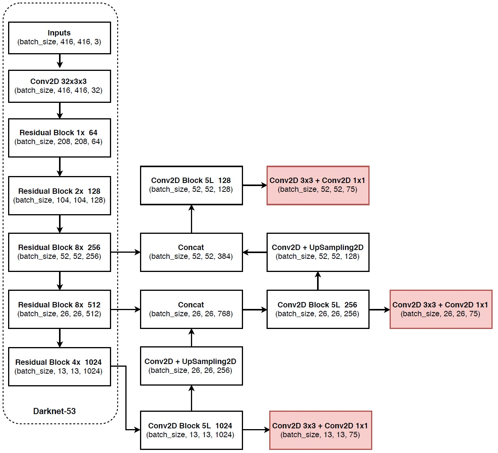
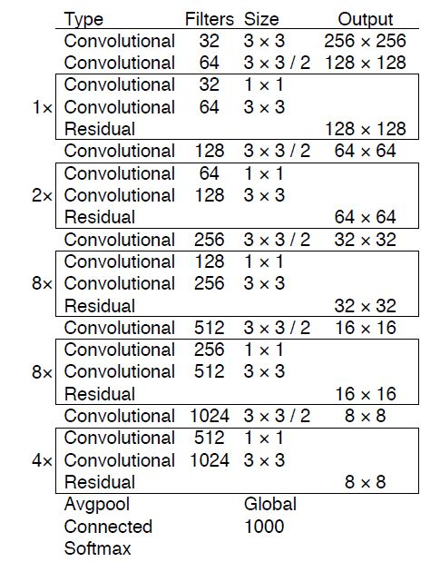

## Yolo v3-2018
* YOLOv3: An Incremental Improvement
* Paper：https://pjreddie.com/media/files/papers/YOLOv3.pdf
* Code：https://github.com/marvis/pytorch-yolo3

## Overview
1. 在Yolov2的基础上使用FPN结构，提升小目标检测的准确率。
2. 提升backbone网络性能，backbone使用DarkNet-53。
3. 为解决多标签分类问题，对象分类用Logistic取代了softmax。

<!--more-->

## why

1. 针对Yolo v1/2中对**小物体不友好**的问题。
2. **深层网络**DarkNet-53替换。
3. 为解决多标签分类问题，对象分类用Logistic取代了softmax

## what
1. 使用FPN解决小物体检测问题。
2. DarkNet-19 + 残差结构实现深层网络结构替换。
3. loss更换。

## how
1. **FPN**

* Yolo v3在输入为416x416时，使用了3个尺度的特征图，52，26，13，feature map上每个点使用3个先验框，则先使用k-means获取9个box，再将这些box按照尺度大框小，尺度小框大的原则分别分配给3个特征图。
2. **Darknet-53**   

3. **loss**
* 损失函数由v2的softmax loss替换为logistic loss
* softmax的**归一化操作**则意味着每个候选框只对应着一个类别，当预测的目标类别很复杂（多个相似类别）的时候，采用logistic regression进行分类，但是可以输出多个分类，比如说，男人，人。